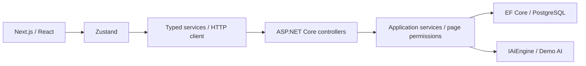

# Notion Clone

A learning and portfolio workspace for organizing nested pages, editing rich-text documents, and sharing knowledge. The frontend uses Next.js and Tiptap; the API uses ASP.NET Core and PostgreSQL. AI is explicitly labeled deterministic Demo AI.

## Screenshots and demo

Screenshots are pending capture from the running application. No public live demo is published in this repository. Use the local setup below.

## Features

- Workspaces with Owner/Admin/Member/Guest roles and centralized page permissions.
- Nested pages, move-cycle prevention, favorites, search, recursive archive/restore, and trash.
- Tiptap editor, debounced serialized autosave, snapshots, and version restoration.
- Comments/replies, page-specific sharing, and anonymous read-only public pages.
- Notifications for registered-user workspace additions, page shares, comments, and replies.
- PNG/JPEG/WEBP/GIF/PDF attachments with size, MIME, extension, and signature checks.
- Demo AI through an engine abstraction, with authorized server-side page context and request limits.

## Tech stack

Frontend: Next.js App Router, React, TypeScript, Zustand, Tiptap, Tailwind CSS, Vitest, pnpm.

Backend: .NET 8 / ASP.NET Core, EF Core, Npgsql/PostgreSQL 16, JWT, BCrypt, xUnit, Docker Compose.

## Architecture



## Repository structure

- `frontend/`: App Router pages, editor/UI, stores, API services, and Vitest tests.
- `backend/src/`: API, Application interfaces/DTOs, Domain entities, Infrastructure services/persistence.
- `backend/tests/`: unit, HTTP integration, and PostgreSQL persistence tests.
- `backend/docs/DEPLOYMENT.md`: migrations, production configuration, health checks, rollback.
- `.github/workflows/ci.yml`: frontend, Linux/PostgreSQL backend, Docker build, Windows backend checks.

## Local setup

Prerequisites: .NET 8 SDK, Node 22 (or Node 24), pnpm 10.34.6, Docker, and Git.

1. Copy `backend/.env.example` to `backend/.env`; replace both password/secret placeholders. Copy `frontend/.env.example` to `frontend/.env.local`.
2. From `backend/`, run `docker compose up -d db`.
3. Set `ConnectionStrings__DefaultConnection` in the backend process environment to `Host=localhost;Port=5432;Database=notion_clone_db;Username=postgres;Password=<your DB_PASSWORD>`. Set `Jwt__Secret` to your signing secret. .NET does not automatically read the Compose `.env` file.
4. From `backend/`:

```sh
dotnet tool restore
dotnet restore NotionClone.sln
dotnet ef database update --project src/NotionClone.Infrastructure --startup-project src/NotionClone.Api -- --environment Development
dotnet run --project src/NotionClone.Api -- --environment Development --urls http://localhost:5000
```

5. From `frontend/`:

```sh
pnpm install --frozen-lockfile
pnpm dev
```

Open `http://localhost:3000`. The API is on port 5000; Swagger is available in Development at `/swagger`. `NEXT_PUBLIC_API_URL` selects the frontend API origin and is required explicitly for production builds.

## Docker

From `backend/`, after supplying secrets in `.env`:

```sh
docker compose up --build -d
docker compose ps
```

PostgreSQL becomes healthy, the one-shot migration service applies the bundle, and the API starts after migration success on port 8080. Set frontend `NEXT_PUBLIC_API_URL=http://localhost:8080` for this workflow. Run the frontend separately. PostgreSQL and uploads use named volumes. `docker compose down` stops services; `down -v` also erases persisted database/upload volumes.

## Database migrations

See [deployment and migrations](backend/docs/DEPLOYMENT.md). From `backend/`:

```sh
dotnet ef migrations add DescriptiveName --project src/NotionClone.Infrastructure --startup-project src/NotionClone.Api -- --environment Development
dotnet ef database update --project src/NotionClone.Infrastructure --startup-project src/NotionClone.Api -- --environment Development
```

The token-hardening migration invalidates pre-existing refresh sessions and removes raw token values. Users must sign in again. Accounts and documents are retained.

## AI configuration

`DefaultAiEngine` is deterministic Demo AI. No external provider/API key is required. Animated responses simulate streaming after the request completes. Page-linked requests require read permission and server-loaded context. A future real provider must implement `IAiEngine` while retaining authorization, limits, cancellation/timeouts, and honest labeling.

## Testing

From `frontend/`:

```sh
pnpm lint
pnpm typecheck
pnpm test
pnpm build
```

Set `NEXT_PUBLIC_API_URL` before build. From `backend/`:

```sh
dotnet restore NotionClone.sln
dotnet build NotionClone.sln --no-restore
dotnet test NotionClone.sln --no-build --no-restore
```

HTTP tests use isolated EF InMemory databases and console logging. Set `NOTION_TEST_POSTGRES` to a **dedicated test server** connection with database-creation rights to also run PostgreSQL tests. Tests create/drop only random `notion_test_<UUID>` databases. Without the variable, the PostgreSQL test is explicitly skipped. Linux CI provides disposable PostgreSQL; Windows CI runs portable unit/HTTP tests. Check actual CI results after the workflow runs.

## Security highlights

Passwords use BCrypt; refresh tokens use SHA-256 hashes, atomic rotation, concurrency checks, and logout revocation. Backend permissions govern pages, sharing, files, and AI. Public DTOs omit private metadata; archived public files require authorization. Uploads are capped at 20 MiB and stored under randomized keys. Production rejects known-placeholder/missing credentials without printing secret values. Authentication/global requests are limited by IP and AI by authenticated user; configure trusted proxy forwarding before public hosting.

## Known limitations

Demo AI only; no real-time co-editing or full Notion parity. Workspace “invitation” adds registered users directly; email acceptance and mention parsing are absent. Token-family compromise detection, advanced version retention, and editor concurrency control remain future work. Files use local storage. Browser E2E/accessibility coverage is not comprehensive; test success is not a production-readiness or perfect-security claim.

## Future improvements

Real AI provider, browser/accessibility automation, object storage, version retention, and PostgreSQL full-text search when scale warrants it.
