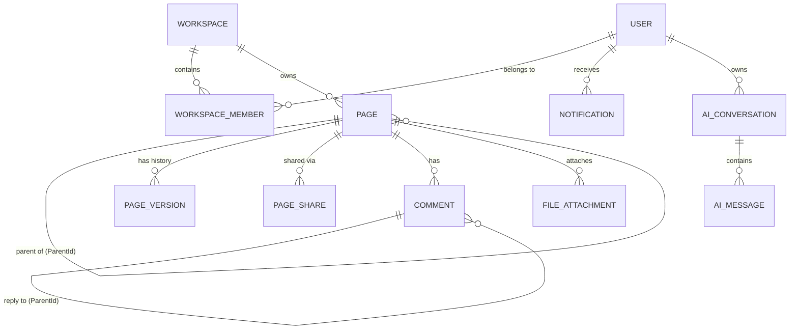

# Phase 0 — Backend Integration Specification

## Executive Summary
This document fulfills the requirements of **Phase 0** in the *Notion Clone — ASP.NET Core Backend Implementation Master Prompt*. It details the comprehensive analysis of the existing Next.js / TypeScript Frontend architecture, types, stores, services, and mock implementations, establishing the entity schema, API endpoints, DTO contracts, authentication, authorization, and persistence requirements for the upcoming ASP.NET Core backend.

---

## 1. Frontend Entities & Schema Map

### 1.1 User & Settings (`src/types/user.ts`)
- **`User`**: `id` (string), `name` (string), `email` (string), `avatarUrl` (string | null), `role` (`UserRole`), `createdAt` (ISO string), `updatedAt` (ISO string)
- **`UserRole`**: `'owner' | 'admin' | 'member' | 'guest'`
- **`UserSettings`**: `userId` (string), `theme` (`'light' | 'dark' | 'system'`), `fontSize` (`'sm' | 'md' | 'lg'`), `lineHeight` (`'compact' | 'normal' | 'relaxed'`), `fullWidth` (boolean), `aiEnabled` (boolean), `aiModel` (string), `aiResponseStyle` (`'concise' | 'balanced' | 'detailed'`)

### 1.2 Workspace & Membership (`src/types/workspace.ts`)
- **`Workspace`**: `id` (string), `name` (string), `slug` (string), `iconEmoji` (string | null), `iconUrl` (string | null), `plan` (`'free' | 'pro' | 'business' | 'enterprise'`), `createdAt` (ISO string), `updatedAt` (ISO string)
- **`WorkspaceMember`**: `id` (string), `workspaceId` (string), `userId` (string), `role` (`UserRole`), `joinedAt` (ISO string)

### 1.3 Page & Hierarchy (`src/types/page.ts`)
- **`Page`**: `id` (string), `workspaceId` (string), `parentId` (string | null), `title` (string), `icon` (string | null), `cover` (string | null), `content` (string - JSON string from Tiptap), `isFavorite` (boolean), `isArchived` (boolean), `isPublic` (boolean), `createdBy` (string - userId), `lastEditedBy` (string - userId), `createdAt` (ISO string), `updatedAt` (ISO string), `lastOpenedAt` (ISO string | null)
- **`PageRole`**: `'viewer' | 'editor' | 'owner'`
- **`PageVersion`**: `id` (string), `pageId` (string), `content` (string), `editedBy` (string), `createdAt` (ISO string)
- **`PageShare`**: `id` (string), `pageId` (string), `userId` (string | null), `email` (string | null), `role` (`PageRole`), `createdAt` (ISO string)

### 1.4 Comments (`src/types/comment.ts`)
- **`Comment`**: `id` (string), `pageId` (string), `userId` (string), `content` (string), `createdAt` (ISO string), `resolved` (boolean), `replies` (`CommentReply[]`)
- **`CommentReply`**: `id` (string), `userId` (string), `content` (string), `createdAt` (ISO string)

### 1.5 Notifications (`src/types/notification.ts`)
- **`Notification`**: `id` (string), `userId` (string), `type` (`'comment' | 'mention' | 'share' | 'system'`), `title` (string), `message` (string), `createdAt` (ISO string), `read` (boolean), `link?` (string)

### 1.6 AI Integration (`src/types/ai.ts`)
- **`AIMessage`**: `id` (string), `role` (`'user' | 'assistant' | 'system'`), `content` (string), `createdAt` (ISO string), `isStreaming?` (boolean), `actionType?` (string)
- **`AIConversation`**: `id` (string), `pageId?` (string), `title?` (string), `messages` (`AIMessage[]`), `createdAt` (ISO string), `updatedAt` (ISO string)

---

## 2. Target ASP.NET Core Backend Entities (EF Core)

```text
Domain Entities
├── User (Id, Email, PasswordHash, Name, AvatarUrl, SystemRole, CreatedAt, UpdatedAt)
├── UserSettings (Id, UserId, Theme, FontSize, LineHeight, FullWidth, AiEnabled, AiModel, AiResponseStyle)
├── Workspace (Id, Name, Slug, IconEmoji, IconUrl, Plan, CreatedAt, UpdatedAt)
├── WorkspaceMember (Id, WorkspaceId, UserId, Role, JoinedAt)
├── Page (Id, WorkspaceId, ParentId, Title, Icon, Cover, Content [JSONB], IsFavorite, IsArchived, IsPublic, CreatedById, LastEditedById, CreatedAt, UpdatedAt, LastOpenedAt)
├── PageVersion (Id, PageId, Content, EditedById, CreatedAt)
├── PageShare (Id, PageId, UserId, Email, Role, CreatedAt)
├── Comment (Id, PageId, UserId, ParentId [nullable], Content, IsResolved, CreatedAt, UpdatedAt)
├── Notification (Id, UserId, Type, Title, Message, Link, IsRead, CreatedAt)
├── FileAttachment (Id, PageId, Name, StorageKey/Url, SizeBytes, MimeType, UploadedById, CreatedAt)
├── AIConversation (Id, PageId [nullable], UserId, Title, CreatedAt, UpdatedAt)
└── AIMessage (Id, ConversationId, Role, Content, ActionType, CreatedAt)
```

---

## 3. Entity Relationships Diagram



---

## 4. Required API Endpoints Specification

### Phase 3: Auth
- `POST /api/auth/register` — Create user account
- `POST /api/auth/login` — Login & receive JWT + refresh token
- `POST /api/auth/refresh` — Refresh access token
- `POST /api/auth/logout` — Revoke token
- `GET /api/auth/me` — Get current authenticated user profile

### Phase 4: Workspaces & Members
- `GET /api/workspaces` — Get user workspaces
- `POST /api/workspaces` — Create workspace
- `GET /api/workspaces/{id}` — Get workspace detail
- `PATCH /api/workspaces/{id}` — Update workspace
- `DELETE /api/workspaces/{id}` — Delete workspace
- `GET /api/workspaces/{id}/members` — List workspace members
- `POST /api/workspaces/{id}/members` — Invite/add member
- `PATCH /api/workspaces/{id}/members/{memberId}` — Update member role
- `DELETE /api/workspaces/{id}/members/{memberId}` — Remove member

### Phase 5 & 6: Pages & Content
- `GET /api/workspaces/{workspaceId}/pages` — List workspace pages
- `POST /api/workspaces/{workspaceId}/pages` — Create new page
- `GET /api/pages/{id}` — Get page metadata & content
- `PATCH /api/pages/{id}` — Update page metadata (title, icon, cover, etc.)
- `DELETE /api/pages/{id}` — Soft delete (move to trash)
- `POST /api/pages/{id}/restore` — Restore soft deleted page
- `DELETE /api/pages/{id}/permanent` — Permanently delete page
- `POST /api/pages/{id}/duplicate` — Duplicate page & subtree
- `POST /api/pages/{id}/favorite` — Toggle favorite status
- `POST /api/pages/{id}/record-open` — Record `lastOpenedAt`
- `PATCH /api/pages/{id}/move` — Update page `parentId`
- `GET /api/pages/{id}/content` — Fetch Tiptap JSON content
- `PUT /api/pages/{id}/content` — Save Tiptap JSON content

### Phase 7: Search, Favorites & Trash
- `GET /api/search?q={query}&workspaceId={workspaceId}` — Full text search on title & content
- `GET /api/trash?workspaceId={workspaceId}` — Get archived pages
- `GET /api/favorites?workspaceId={workspaceId}` — Get favorited pages

### Phase 8: Comments & Sharing
- `GET /api/pages/{pageId}/comments` — List comments for page
- `POST /api/pages/{pageId}/comments` — Create comment
- `POST /api/comments/{commentId}/reply` — Reply to comment
- `PATCH /api/comments/{commentId}/resolve` — Resolve comment
- `DELETE /api/comments/{commentId}` — Delete comment
- `GET /api/pages/{pageId}/shares` — Get page share settings
- `POST /api/pages/{pageId}/shares` — Share page with user/email

### Phase 9: Notifications
- `GET /api/notifications` — Get user notifications
- `PATCH /api/notifications/{id}/read` — Mark notification read
- `POST /api/notifications/read-all` — Mark all user notifications read

### Phase 10: Files
- `POST /api/files` — Upload file attachment / media
- `GET /api/files/{id}` — Retrieve file
- `DELETE /api/files/{id}` — Delete file attachment

### Phase 11: AI Integration
- `POST /api/ai/chat` — AI generation / streaming proxy

---

## 5. Request & Response DTO Candidates

### Request DTOs
```csharp
public record RegisterRequest(string Email, string Password, string Name);
public record LoginRequest(string Email, string Password);
public record CreateWorkspaceRequest(string Name, string? IconEmoji);
public record UpdateWorkspaceRequest(string? Name, string? IconEmoji, string? IconUrl, string? Plan);
public record CreatePageRequest(Guid WorkspaceId, Guid? ParentId, string? Title, string? Icon);
public record UpdatePageRequest(string? Title, string? Icon, string? Cover, string? Content, bool? IsFavorite, bool? IsArchived, bool? IsPublic);
public record MovePageRequest(Guid? ParentId);
public record CreateCommentRequest(Guid PageId, string Content, Guid? ParentId);
public record AiGenerateRequest(string Prompt, string? ContextText, string ActionType);
```

### Response DTOs
```csharp
public record AuthResponseDto(UserDto User, string AccessToken, string RefreshToken, DateTime ExpiresAt);
public record UserDto(Guid Id, string Name, string Email, string? AvatarUrl, string Role, DateTime CreatedAt, DateTime UpdatedAt);
public record WorkspaceDto(Guid Id, string Name, string Slug, string? IconEmoji, string? IconUrl, string Plan, DateTime CreatedAt, DateTime UpdatedAt);
public record PageDto(Guid Id, Guid WorkspaceId, Guid? ParentId, string Title, string? Icon, string? Cover, string Content, bool IsFavorite, bool IsArchived, bool IsPublic, Guid CreatedBy, Guid LastEditedBy, DateTime CreatedAt, DateTime UpdatedAt, DateTime? LastOpenedAt);
public record CommentDto(Guid Id, Guid PageId, Guid UserId, string Content, DateTime CreatedAt, bool Resolved, List<CommentReplyDto> Replies);
public record CommentReplyDto(Guid Id, Guid UserId, string Content, DateTime CreatedAt);
public record NotificationDto(Guid Id, Guid UserId, string Type, string Title, string Message, DateTime CreatedAt, bool Read, string? Link);
public record SearchResultDto(PageDto Page, List<string> Breadcrumbs, string MatchType, string? Snippet);
```

---

## 6. Security, Authentication & Authorization Requirements
1. **Authentication**: JWT Access Token (short-lived) + Refresh Token (stored securely). Passwords hashed using BCrypt or ASP.NET Identity PasswordHasher.
2. **Workspace Authorization**: Mandatory policy enforcement on all workspace endpoints ensuring the requesting `UserId` belongs to `WorkspaceMember` for the given `WorkspaceId`.
3. **Role Enforcement**:
   - `Owner`/`Admin`: Workspace level settings, member removal, workspace deletion.
   - `Member`/`Editor`: Read/Write access to pages and comments.
   - `Viewer`: Read-only access.
4. **Hierarchy Integrity**: Preventing cyclic dependencies during page move operations (`ParentId` assignment).

---

## 7. Persistence Requirements
1. **Database**: PostgreSQL with Entity Framework Core (Code First).
2. **JSONB Content**: `Page.Content` stored as `jsonb` type in PostgreSQL to natively support Tiptap JSON document structure and full-text queries.
3. **Soft Deletion**: `Page.IsArchived` field used for soft delete. Cascading soft deletion to nested children (`collectDescendantIds`).

---

## 8. Frontend / Backend Mismatches Identified & Recommendations

| Mismatch | Details | Recommendation |
| :--- | :--- | :--- |
| **Comment Schema Dual Definition** | `types/comment.ts` uses `resolved` and `replies: CommentReply[]`, while `types/common.ts` uses `isResolved` and `parentId`. | Standardize API Response DTO to output `resolved` and nested `replies` to align with the active UI (`types/comment.ts`). |
| **Notification Schema Dual Definition** | `types/notification.ts` uses `message` & `read`, while `types/common.ts` uses `body` & `isRead`. | Standardize API Response DTO to output `message` and `read` matching `types/notification.ts`. |
| **Frontend Authentication Absence** | Frontend currently hardcodes `user-1` and lacks an auth screen or HTTP interceptor layer. | When introducing Phase 3, frontend service layer can wrap `fetch` calls with JWT Bearer header without requiring major UI rewrites. |
| **Search Text Parsing** | Mock service currently parses Tiptap JSON manually in JS (`extractText`). | Backend will use PostgreSQL JSONB text extraction / TSVector capabilities for fast server-side search. |

---

## 9. Next Steps
Phase 0 analysis is complete. Waiting for explicit user approval before moving to **Phase 1 — Backend Foundation**.
